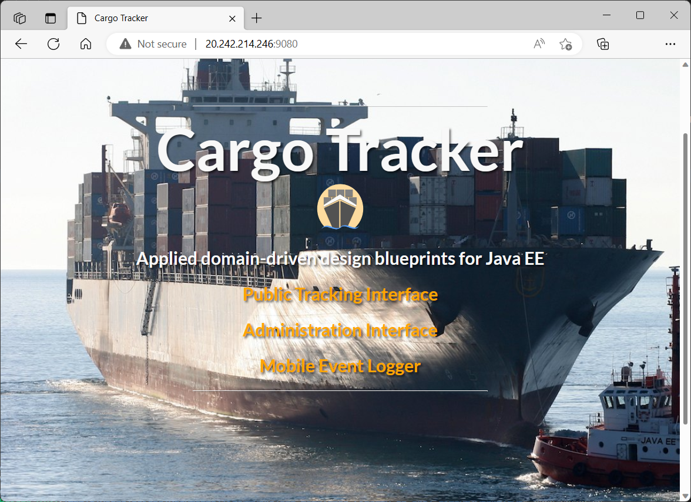

# Open Liberty Cargo Tracker Application Deployed to Azure Kubernetes Service (AKS)

## Description

This is a sample app template of the Domain-Driven Design Jakarta EE application. The application is built with Maven and deployed to Open Liberty running in Azure Kubernetes Service (AKS). The app template uses the [official Azure offer for running Liberty on AKS](https://aka.ms/liberty-aks). The application is exposed by Azure Load Balancer service via Public IP address.

## Deploy Open Liberty Application to Azure Kubernetes Service:

--
Tech stack:

- Azure Container Registry
- Azure Kubernetes Service
- Azure PostgreSQL DB
- GitHub Actions
- Bicep
- Docker
- Maven
- Java

---

## Introduction

This is a quickstart template. It deploys the following:

* Deploying Cargo Tracker App:
  * Create ProgresSQL Database
  * Create the Cargo Tracker - build with Maven
  * Provisioning Azure Infra Services with ARM templates - build with BICEP
    * Create an Azure Container Registry
    * Create an Azure Kubernetes Service
    * Build your app, Open Liberty into an image
    * Push your app image to the container registry
    * Deploy your app to AKS
    * Expose your app with the Azure Load Balancer service
  * Verify your app

* Cargo Tracker on Automated CI/CD with GitHub Action
  * CI/CD on GitHub Action
  * CI/CD in action with the app

> Refer to the [App Templates](https://github.com/microsoft/App-Templates) repo Readme for more samples that are compatible with [AzureAccelerators](https://github.com/Azure/azure-dev/).

## Prerequisites

- Local shell with Azure CLI installed or [Azure Cloud Shell](https://ms.portal.azure.com/#cloudshell/)
- Azure Subscription, on which you are able to create resources and assign permissions
  - View your subscription using ```az account show``` 
  - If you don't have an account, you can [create one for free](https://azure.microsoft.com/free). 
- GitHub CLI (optional, but strongly recommended). To install the GitHub CLI on your dev environment, see [Installation](https://cli.github.com/manual/installation).


## Getting Started

1. Fork the repository by clicking the 'Fork' button on the top right of the page.
This creates a local copy of the repository for you to work in. 

2. Configure GITHUB Actions:  Follow the instructions in the [GITHUB_ACTIONS_CONFIG.md file](.github/GITHUB_ACTIONS_CONFIG.md) (Located in the .github folder.)

4. Manually run the workflow

* Under your repository name, click Actions.
* In the left sidebar, click the workflow "Setup OpenLiberty on AKS".
* Above the list of workflow runs, select Run workflow.
* Configure the workflow.
  + Use the Branch dropdown to select the workflow's main branch.
  + For **Included in names to disambiguate. Get from another pipeline execution**, enter disambiguation prefix, e.g. `test01`.

5. Click Run workflow.

## Workflow description

As mentioned above, the app template uses the [official Azure offer for running Liberty on AKS](https://aka.ms/liberty-aks). The workflow uses the source code behind that offer by checking it out and invoking it from Azure CLI.

### Job: preflight

This job is to build Liberty on AKS template into a ZIP file containing the ARM template to invoke.

* Set up environment to build the Liberty on AKS templates
  + Set up JDK 1.8
  + Set up bicep 0.11.1

* Download dependencies
  + Checkout azure-javaee-iaas, this is a precondition necessary to build Liberty on AKS templates. For more details, see [Azure Marketplace Azure Application (formerly known as Solution Template) Helpers](https://github.com/Azure/azure-javaee-iaas).

* Checkout and build Liberty on AKS templates
  + Checkout ${{ env.aksRepoUserName }}/azure.liberty.aks. Checkout [WASdev/azure.liberty.aks](https://github.com/WASdev/azure.liberty.aks) by default. This repository contains all the BICEP templates that provision Azure resources, configure Liberty and deploy app to AKS. 
  + Build and test ${{ env.aksRepoUserName }}/azure.liberty.aks. Build and package the Liberty on AKS templates into a ZIP file (e.g. azure.liberty.aks-1.0.32-arm-assembly.zip). The structure of the ZIP file is:

    ```text
    ├── mainTemplate.json (ARM template that is built from BICEP files, which will be invoked for the following deployments)
    └── scripts (shell scripts and metadata)
    ```

  + Archive Archive azure.liberty.aks template template. Upload the ZIP file to the pipeline. The later jobs will download the ZIP file for further deployments.

### Job: deploy-db

This job is to deploy PostgreSQL server and configure firewall setting.

* Set Up Azure Database for PostgreSQL
  + azure-login. Login Azure.
  + Create Resource Group. Create a resource group to which the database will deploy.
  + Set Up Azure Postgresql to Test dbTemplate. Provision Azure Database for PostgreSQL Single Server. The server allows access from Azure services.

### Job: deploy-openliberty-on-aks

This job is to provision Azure resources, run Open Liberty Operator on AKS using the solution template.

* Download the Liberty on AKS solution template
  + Checkout ${{ env.aksRepoUserName }}/azure.liberty.aks. Checkout [WASdev/azure.liberty.aks](https://github.com/WASdev/azure.liberty.aks) to find the version information.
  + Get version information from azure.liberty.aks/pom.xml. Get the version info for solution template ZIP file, which is used to generate the ZIP file name: `azure.liberty.aks-${version}-arm-assembly.zip`
  + Output artifact name for Download action. Generate and output the ZIP file name: `azure.liberty.aks-${version}-arm-assembly.zip`.
  + Download artifact for deployment. Download the ZIP file that is built in job:preflight.

* Deploy Liberty on AKS
  + azure-login. Login Azure.
  + Create Resource Group. Create a resource group for Liberty on AKS.
  + Checkout cargotracker. Checkout the parameter template.
  + Prepare parameter file. Set values to the parameters.
  + Validate Deploy of Open Liberty Server Cluster Domain offer. Validate the parameters file in the context of the bicep template to be invoked. This will catch some errors before taking the time to start the full deployment. `--template-file` is the mainTemplate.json from solution template ZIP file. `--parameters` is the parameter file created in last step.
  + Deploy Open Liberty Server Cluster Domain offer. Invoke the mainTemplate.json to deploy resources and configurations. After the deployment completes, you'll get the following result:
    + An Azure Container Registry. It'll store app image in the later steps.
    + An Azure Kubernetes Service with Open Liberty Operator running in `default` namespace.

### Job: deploy-cargo-tracke

This job is to build app, push it to ACR and apply it to Open Liberty server running on AKS.

* Prepare env
  + Set up JDK 1.8。
  + Install jq.
  + Prepare variables. Obtain AKS and ACR resource properties that will be used in later deployment.

* Deploy Cargo Tracker
  + Checkout cargotracker. Checkout source code of cargo tracker from this repository.
  + Build the app. Set required environment variables and build cargo tracker with Maven.
  + Query version string for deployment verification. Obtain the app version string for later verification.
  + Build image and upload to ACR. Build cargo tracker into a docker image with docker file locating in [Dockerfile](Dockerfile), and push the image to ACR.
  + Connect to AKS cluster. Connect to AKS cluster to deploy cargo tracker.
  + Apply deployment files. Apply data source configuration in `target/db-secret.yaml` and cargo tracker metadata in `target/openlibertyapplication.yaml`. This will cause cargo tracker deployed to the AKS cluster.
  + Verify pods are ready. Make sure cargo tracker is live.
  + Query Application URL. Obtain cargo tracker URL.
  + Verify that the app is update. Make sure cargo tracker is running by validating its version string.
  + Print app URL. Print the cargo tracker URL to pipeline summary page. Now you'are able to access cargo tracker with the URL from your browser.

## Cargo Tracker Website



If you wish to view the Cargo Tracker Deployment, you have the following options:

- Open the pipeline "Setup OpenLiberty on AKS". You will find the **Summary** page.
- Scroll down to **deploy-cargo-tracker summary**, you'll find the app URL.
- Open your web browser, navigate to the application URL, you will see the Cargo Tracker landing page.

## Exercise Cargo Tracker Functionality

1. On the main page, select **Public Tracking Interface** in new window. 

   1. Enter **ABC123** and select **Track!**

   1. Observe what the **next expected activity** is.

1. On the main page, select **Administration Interface**, then, in the left navigation column select **Live** in a new window.  This opens up a map view.

   1. Mouse over the pins and find the one for **ABC123**.  Take note of the information in the hover window.

1. On the main page, select **Mobile Event Logger**.  This opens up in a new, small, window.

1. Drop down the menu and select **ABC123**.  Select **Next**.

1. Select the **Location** using the information in the **next expected activity**.  Select **Next**.

1. Select the **Event Type** using the information in the **next expected activity**.  Select **Next**.

1. Select the **Voyage** using the information in the **next expected activity**.  Select **Next**.

1. Set the **Completion Date** a few days in the future.  Select **Next**.

1. Review the information and verify it matches the **next expected activity**.  If not, go back and fix it.  If so, select **Submit**.

1. Back on the **Public Tracking Interface** select **Tracking** then enter **ABC123** and select **Track**.  Observe that a different. **next expected activity** is listed.

1. If desired, go back to **Mobile Event Logger** and continue performing the next activity.

## Learn more about Cargo Tracker

See [Eclipse Cargo Tracker - Applied Domain-Driven Design Blueprints for Jakarta EE](cargo-tracker.md)