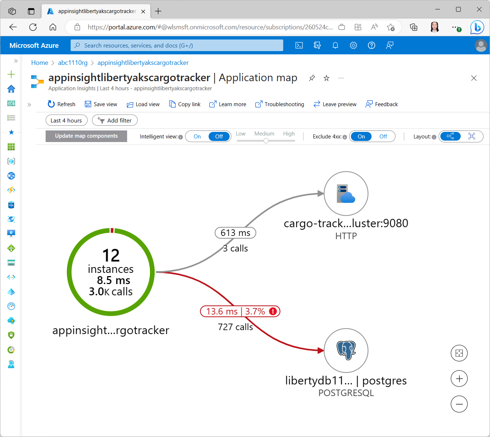
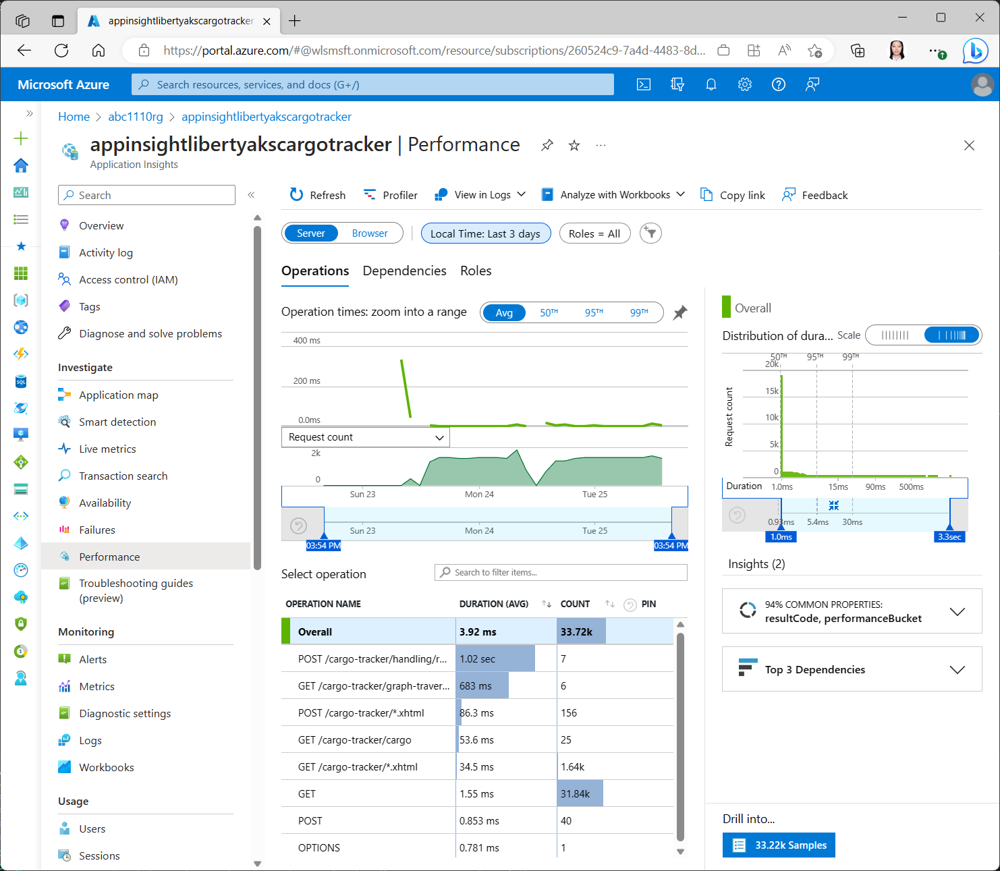
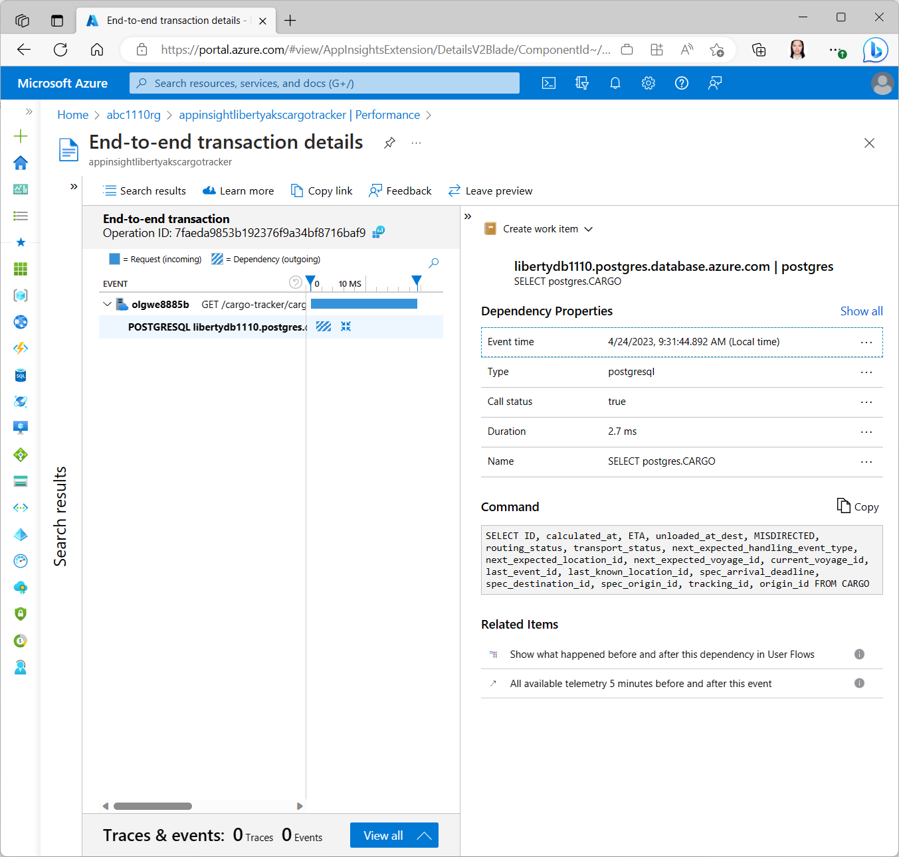
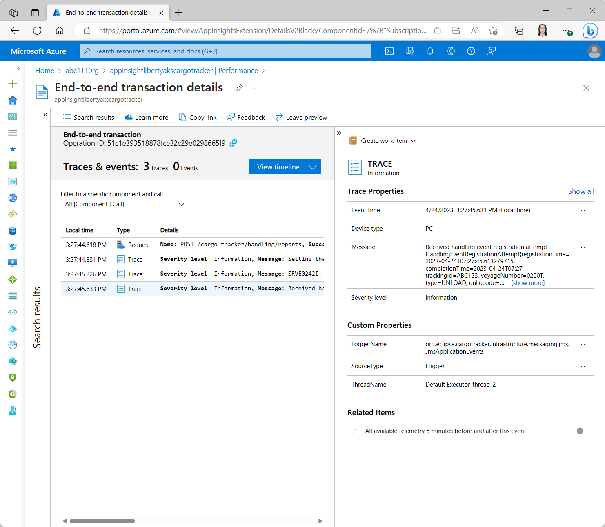
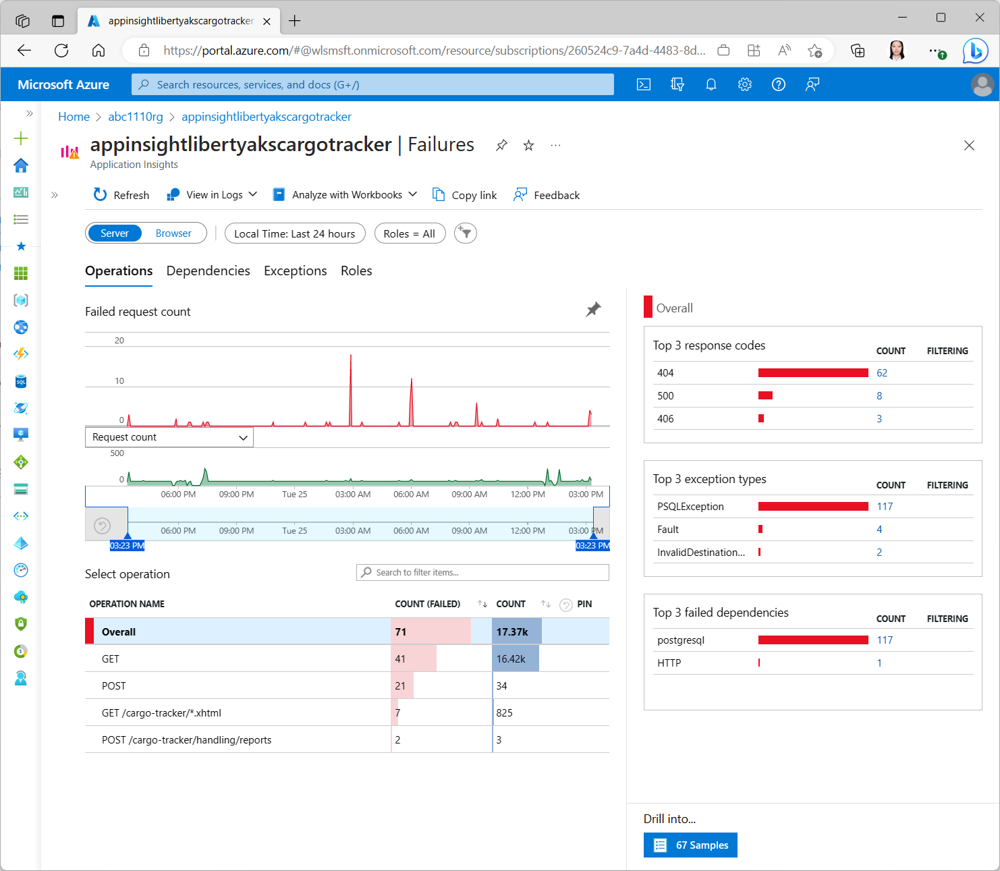
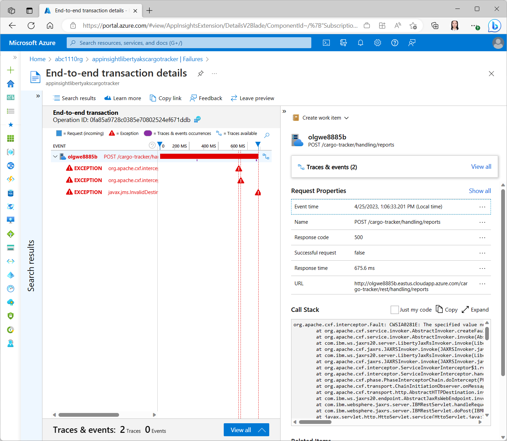
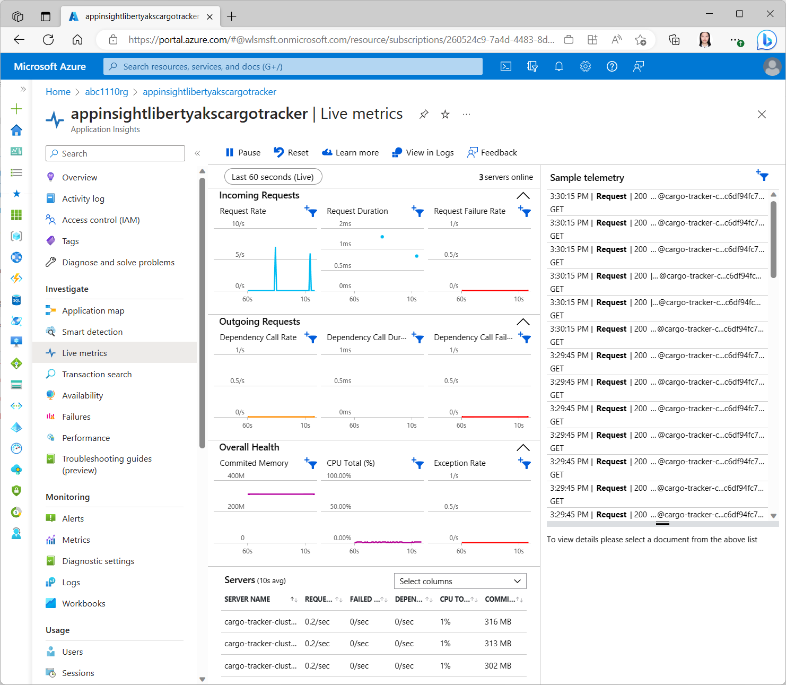

# Deploy Cargo Tracker to Open Liberty on Azure Kubernetes Service (AKS)

This sample shows you how to deploy an existing Liberty application to AKS using Liberty on AKS solution templates. When you're finished, you can continue to manage the application via the Azure CLI or Azure Portal.

Cargo Tracker is a Domain-Driven Design Jakarta EE application. The application is built with Maven and deployed to Open Liberty running on Azure Kubernetes Service (AKS). The application is exposed by Azure Application Gateway service. For quickstart uses the [official Azure offer for running Liberty on AKS](https://aka.ms/liberty-aks), see [Deploy a Java application with Open Liberty or WebSphere Liberty on an Azure Kubernetes Service (AKS) cluster](https://learn.microsoft.com/azure/aks/howto-deploy-java-liberty-app). 

* [Deploy Cargo Tracker to Open Liberty on Azure Kubernetes Service (AKS)]()
  * [Introduction](#introduction)
  * [Prerequisites](#prerequisites)
  * [Unit-1 - Deploy and monitor Cargo Tracker](#unit-1---deploy-and-monitor-cargo-tracker)
    * [Clone Cargo Tracker](#clone-cargo-tracker)
    * [Prepare your variables for deployments](#prepare-your-variables-for-deployments)
    * [Clone Liberty on AKS Bicep templates](#clone-liberty-on-aks-bicep-templates)
    * [Sign in to Azure](#sign-in-to-azure)
    * [Create a resource group](#create-a-resource-group)
    * [Prepare deployment parameters](#prepare-deployment-parameters)
    * [Invoke Liberty on AKS Bicep template to deploy the Open Liberty Operator](#invoke-liberty-on-aks-bicep-template-to-deploy-the-open-liberty-operator)
    * [Create an Azure Database for PostgreSQL instance](#create-an-azure-database-for-postgresql-instance)
    * [Create Application Insights](#create-application-insights)
    * [Build and deploy Cargo Tracker](#build-and-deploy-cargo-tracker)
    * [Monitor Liberty application](#monitor-liberty-application)
      * [Use Cargo Tracker and make a few HTTP calls](#use-cargo-tracker-and-make-a-few-http-calls)
      * [Start monitoring Cargo Tracker in Application Insights](#start-monitoring-cargo-tracker-in-application-insights)
      * [Start monitoring Liberty logs in Azure Log Analytics](#start-monitoring-liberty-logs-in-azure-log-analytics)
      * [Start monitoring Cargo Tracker logs in Azure Log Analytics](#start-monitoring-cargo-tracker-logs-in-azure-log-analytics)
  * [Unit-2 - Automate deployments using GitHub Actions](#unit-2---automate-deployments-using-github-actions)
  * [Appendix 1 - Exercise Cargo Tracker Functionality](#appendix-1---exercise-cargo-tracker-functionality)
  * [Appendix 2 - Learn more about Cargo Tracker](#appendix-2---learn-more-about-cargo-tracker)

## Introduction

In this sample, you will:

* Deploy Cargo Tracker:
  * Create PostgreSQL Database
  * Create the Cargo Tracker - build with Maven
  * Provision Azure Infra Services with BICEP templates
    * Create an Azure Container Registry
    * Create an Azure Kubernetes Service
    * Build your application, Open Liberty into a container image
    * Push your application image to the container registry
    * Deploy your application to AKS
    * Expose your application with the Azure Application Gateway
  * Verify your application
  * Monitor application
  * Automate deployments using GitHub Actions

## Prerequisites

- [Azure Cloud Shell](https://ms.portal.azure.com/#cloudshell/). This sample was tested with:
  - JDK: openjdk version `11.0.18 2023-01-17 LTS`.
  - GIT: git version `2.33.6`.
  - Kubernetes CLI version as following:

     ```bash
     Client Version: version.Info{Major:"1", Minor:"26", GitVersion:"v1.26.3", GitCommit:"9e644106593f3f4aa98f8a84b23db5fa378900bd", GitTreeState:"clean", BuildDate:"2023-03-15T13:40:17Z", GoVersion:"go1.19.7", Compiler:"gc", Platform:"linux/amd64"}
     Kustomize Version: v4.5.7
     ```
  - Maven: Apache Maven `3.8.7` (NON_CANONICAL).
- Azure Subscription, on which you are able to create resources and assign permissions
  - View your subscription using ```az account show``` 
  - If you don't have an account, you can [create one for free](https://azure.microsoft.com/free). 
  - Your subscription is accessed using an Azure Service Principal with at least **Contributor** and **User Access Administrator** permissions.

## Unit-1 - Deploy and monitor Cargo Tracker

### Clone Cargo Tracker

Clone the sample app repository to your development environment.

```bash
mkdir cargotracker-liberty-aks
DIR="$PWD/cargotracker-liberty-aks"

git clone https://github.com/Azure-Samples/cargotracker-liberty-aks.git ${DIR}/cargotracker
```

### Prepare your variables for deployments

Create a bash script with environment variables by making a copy of the supplied template:

```bash
cp ${DIR}/cargotracker/.scripts/setup-env-variables-template.sh ${DIR}/cargotracker/.scripts/setup-env-variables.sh
```

Open `${DIR}/cargotracker/.scripts/setup-env-variables.sh` and enter the following information. You can keep them with default values.

```bash
export LIBERTY_AKS_REPO_REF="964f6463d6cfda9572d215cdd53109cee8f4ff1e" # WASdev/azure.liberty.aks
export RESOURCE_GROUP_NAME="abc1110rg" # customize this
export DB_RESOURCE_NAME="libertydb1110" # PostgreSQL server name, customize this
export DB_SERVER_NAME="${DB_RESOURCE_NAME}.postgres.database.azure.com" # PostgreSQL host name
export DB_PASSWORD="Secret123456" # PostgreSQL database password
export DB_PORT_NUMBER=5432
export DB_NAME=postgres
export DB_USER=liberty@${DB_RESOURCE_NAME}
export NAMESPACE=default
```

Then, set the environment:

```bash
source ${DIR}/cargotracker/.scripts/setup-env-variables.sh
```

### Clone Liberty on AKS Bicep templates

```bash
git clone https://github.com/WASdev/azure.liberty.aks ${DIR}/azure.liberty.aks

cd ${DIR}/azure.liberty.aks
git checkout ${LIBERTY_AKS_REPO_REF}

cd ${DIR}
```

### Sign in to Azure

If you haven't already, sign into your Azure subscription by using the `az login` command and follow the on-screen directions.

```bash
az login
```

If you have multiple Azure tenants associated with your Azure credentials, you must specify which tenant you want to sign in to. You can do this with the `--tenant` option. For example, `az login --tenant contoso.onmicrosoft.com`.

### Create a resource group

Create a resource group with `az group create`. Resource group names must be globally unique within a subscription.

```bash
az group create \
    --name ${RESOURCE_GROUP_NAME} \
    --location eastus
```

### Prepare deployment parameters

Several parameters are required to invoke the Bicep templates. Parameters and their value are listed in the table. Make sure the variables have correct value.

| Parameter Name | Value | Note |
|----------------|-------|------|
| `_artifactsLocation ` | `https://raw.githubusercontent.com/WASdev/azure.liberty.aks/${LIBERTY_AKS_REPO_REF}/src/main/` | This quickstart is using templates and scripts from `WASdev/azure.liberty.aks/${LIBERTY_AKS_REPO_REF}`. | 
| `createCluster` | `true` | This value causes provisioning of Azure Kubernetes Service. |
| `vmSize` | `Standard_DS2_v2` | VM size of AKS node. |
| `minCount` | `1` | Minimum count of AKS nodes. |
| `maxCount` | `5` | Maximum count of AKS nodes. |
| `createACR` | `true` | This value causes provisioning of Azure Container Registry. |
| `deployApplication` | `false` | The application will be deployed on the later section. |
| `enableAppGWIngress` | `true` | The value causes to provision Azure Application Gateway Ingress Controller. |
| `appGatewayCertificateOption` | `generateCert` | The option causes generation self-signed certificate for Application Gateway. |
| `enableCookieBasedAffinity` | `true` | The value causes to enable cookie-based affinity for Application Gateway backend setting. |

Create parameter file.

```bash
cat <<EOF >parameters.json
{
  "$schema": "https://schema.management.azure.com/schemas/2015-01-01/deploymentParameters.json#",
  "contentVersion": "1.0.0.0",
  "parameters": {
    "_artifactsLocation": {
        "value": "https://raw.githubusercontent.com/WASdev/azure.liberty.aks/${LIBERTY_AKS_REPO_REF}/src/main/"
    },
    "location": {
        "value": "eastus"
    },
    "createCluster": {
        "value": true
    },
    "vmSize": {
        "value": "Standard_DS2_v2"
    },
    "minCount": {
        "value": 1
    },
    "maxCount": {
        "value": 5
    },
    "createACR": {
        "value": true
    },
    "deployApplication": {
        "value": false
    },
    "enableAppGWIngress": {
        "value": true
    },
    "appGatewayCertificateOption": {
        "value": "generateCert"
    },
    "enableCookieBasedAffinity": {
        "value": true
    }
  }
}
EOF
```

### Invoke Liberty on AKS Bicep template to deploy the Open Liberty Operator

Invoke the Bicep template in `${DIR}/azure.liberty.aks/src/main/bicep/mainTemplate.bicep` to deploy Open Liberty Operator on AKS.

Run the following command to validate the parameter file.

```bash
az deployment group validate \
  --resource-group ${RESOURCE_GROUP_NAME} \
  --name liberty-on-aks \
  --parameters @parameters.json \
  --template-file ${DIR}/azure.liberty.aks/src/main/bicep/mainTemplate.bicep
```

The command should be completed without error. If there is, you must resolve it before moving on.

Next, invoke the template.

```bash
az deployment group create \
  --resource-group ${RESOURCE_GROUP_NAME} \
  --name liberty-on-aks \
  --parameters @parameters.json \
  --template-file ${DIR}/azure.liberty.aks/src/main/bicep/mainTemplate.bicep
```

It takes more than 10 minutes to finish the deployment. The Open Liberty Operator is running in namespace `default`.

If you are using Azure Cloud Shell, and the terminal is disconnected, run source <path-to>/cargotracker/.scripts/setup-env-variables.sh to set the variables.

### Create an Azure Database for PostgreSQL instance

Use `az postgres server create` to provision a PostgreSQL instance on Azure. The data server allows access from Azure Services.

```bash
az postgres server create \
  --resource-group ${RESOURCE_GROUP_NAME} \
  --name ${DB_RESOURCE_NAME}  \
  --location eastus \
  --admin-user liberty \
  --ssl-enforcement Disabled \
  --public-network-access Enabled \
  --admin-password ${DB_PASSWORD} \
  --sku-name B_Gen5_1

  echo "Allow Access To Azure Services"
  az postgres server firewall-rule create \
  -g ${RESOURCE_GROUP_NAME} \
  -s ${DB_RESOURCE_NAME} \
  -n "AllowAllWindowsAzureIps" \
  --start-ip-address "0.0.0.0" \
  --end-ip-address "0.0.0.0"
```

### Create Application Insights

To integrate with Application Insights, you need to have an Application Insights instance and expose metrics to it using the Java agent.

First, install or upgrade `application-insights` extension.

```bash
az extension add --upgrade -n application-insights
```

Create a Log Analytics Workspace.

```bash
az monitor log-analytics workspace create \
  --resource-group ${RESOURCE_GROUP_NAME} \
  --workspace-name ${WORKSPACE_NAME} \
  --location eastus

WORKSPACE_ID=$(az monitor log-analytics workspace list -g ${RESOURCE_GROUP_NAME} --query '[0].id' -o tsv)
```


This quickstart uses Container Insights to monitor AKS. Enable it with the following commands. 

```bash
AKS_NAME=$(az aks list -g ${RESOURCE_GROUP_NAME} --query [0].name -o tsv)

az aks enable-addons \
  --addons monitoring \
  --name ${AKS_NAME} \
  --resource-group ${RESOURCE_GROUP_NAME} \
  --workspace-resource-id ${WORKSPACE_ID}
```

Next, provision Application Insights.

```bash
az monitor app-insights component create \
  --resource-group ${RESOURCE_GROUP_NAME} \
  --app ${APPINSIGHTS_NAME} \
  --location eastus \
  --workspace ${WORKSPACE_ID}
```

Obtain the connection string of Application Insights which will be used in later section.

```bash
export APPLICATIONINSIGHTS_CONNECTION_STRING=$(az monitor app-insights component show \
  --resource-group ${RESOURCE_GROUP_NAME} \
  --query '[0].connectionString' -o tsv)
```

### Build and deploy Cargo Tracker

First, prepare the environment variables used in the build time. If you haven't set the deployment variables, run the following command:

```bash
source ${DIR}/cargotracker/.scripts/setup-env-variables.sh
```

Next, obtain the registry information.

```bash
export REGISTRY_NAME=$(az acr list -g ${RESOURCE_GROUP_NAME} --query '[0].name' -o tsv)
export LOGIN_SERVER=$(az acr show -n ${REGISTRY_NAME} -g ${RESOURCE_GROUP_NAME} --query 'loginServer' -o tsv)
```

Now, it's ready to build Cargo Tracker.

```bash
mvn clean install -PopenLibertyOnAks --file ${DIR}/cargotracker/pom.xml
```

The war file locates at `${DIR}/cargotracker/target/cargo-tracker.war`. 

The following steps are to build a container image which will be deployed to AKS. 

The image tag is constructed with `${project.artifactId}:${project.version}`. Run the following command to obtain their values.

```bash
IMAGE_NAME=$(mvn -q -Dexec.executable=echo -Dexec.args='${project.artifactId}' --non-recursive exec:exec --file ${DIR}/cargotracker/pom.xml) 
IMAGE_VERSION=$(mvn -q -Dexec.executable=echo -Dexec.args='${project.version}' --non-recursive exec:exec --file ${DIR}/cargotracker/pom.xml)
```

Run `ac acr built` command to build the container image.

```bash
cd ${DIR}/cargotracker/target
az acr build -t ${IMAGE_NAME}:${IMAGE_VERSION} -r ${REGISTRY_NAME} .
```

The image is ready to deploy to AKS. Run the following command to connect to AKS cluster.

```bash
AKS_NAME=$(az aks list -g ${RESOURCE_GROUP_NAME} --query [0].name -o tsv)

az aks get-credentials --resource-group ${RESOURCE_GROUP_NAME} --name $AKS_NAME
```

Run the following command to create secrets for data source connection and Application Insights connection.

Then deploy the container image to AKS cluster.

```bash
kubectl apply -f ${DIR}/cargotracker/target/db-secret.yaml
kubectl apply -f ${DIR}/cargotracker/target/app-insight.yaml
kubectl apply -f ${DIR}/cargotracker/target/openlibertyapplication.yaml

kubectl get pod -w
```

Press `Control + C` to exit the watching mode. 

Now, Cargo Tracker is running on Open Liberty, and connecting to Application Insights. You are able to monitor the application.

### Monitor Liberty application

This section uses Application Insights and Azure Log Analytics to monitor Open Liberty and Cargo Tracker. You can find the resource from your working resource group.

#### Use Cargo Tracker and make a few HTTP calls

You can open Cargo Tracker in your web browser and follow [Appendix 1 - Exercise Cargo Tracker Functionality](#appendix-1---exercise-cargo-tracker-functionality) to make some calls.

Use the following commands to obtain URL of Cargo Tracker. When accessing the application, if you get "502 Bad Gateway" response, just wait a few minutes.


```bash
GATEWAY_PUBLICIP_ID=$(az network application-gateway list \
  --resource-group ${RESOURCE_GROUP_NAME} \
  --query '[0].frontendIPConfigurations[0].publicIPAddress.id' -o tsv)

GATEWAY_URL=$(az network public-ip show --ids ${GATEWAY_PUBLICIP_ID} --query 'dnsSettings.fqdn' -o tsv)

CARGO_TRACKER_URL="http://${GATEWAY_URL}/cargo-tracker/"

echo "Cargo Tracker URL: ${CARGO_TRACKER_URL}"
```

You can also `curl` the REST API exposed by Cargo Tracker. It's strongly recommended you get familiar with Cargo Tracker with the above exercise.

The `/graph-traversal/shortest-path` REST API allows you to retrieve shortest path from origin to destination.

The API requires the following parameters:

| Parameter Name | Value |
| ------------------| ----------------- |
| `origin` | The UN location code value of origin and destination must be five characters long, the first two must be alphabetic and the last three must be alphanumeric (excluding 0 and 1). |
| `destination` | The UN location code value of origin and destination must be five characters long, the first two must be alphabetic and the last three must be alphanumeric (excluding 0 and 1). |
| `deadline` | **Optional**. Deadline value must be eight characters long. |

You can run the following curl command:

```bash
curl -X GET -H "Accept: application/json" "${CARGO_TRACKER_URL}rest/graph-traversal/shortest-path?origin=CNHKG&destination=USNYC"
```

The `/handling/reports` REST API allows you to send an asynchronous message with the information to the handling event registration system for proper registration.

The API requires the following parameters:

| Parameter Name | Value |
| ------------------| ----------------- |
| `completionTime` | Must be ClockHourOfAmPm. Format: `m/d/yyyy HH:MM tt`, e.g `3/29/2023 9:30 AM` |
| `trackingId` | Tracking ID must be at least four characters. |
| `eventType` | Event type value must be one of: RECEIVE, LOAD, UNLOAD, CUSTOMS, CLAIM. |
| `unLocode` | The UN location code value of origin and destination must be five characters long, the first two must be alphabetic and the last three must be alphanumeric (excluding 0 and 1). |
| `voyageNumber` | **Optional**. Voyage number value must be between four and five characters long. |

You can run the following `curl` command to load onto voyage 0200T in New York for trackingId of `ABC123`:

```bash
DATE=$(date +'%m/%d/%Y %I:%M %p')
cat <<EOF >data.json
{
  "completionTime": "${DATE}",
  "trackingId": "ABC123",
  "eventType": "UNLOAD",
  "unLocode": "USNYC",
  "voyageNumber": "0200T"
}
EOF

curl -X POST -d "@data.json" -H "Content-Type: application/json" ${CARGO_TRACKER_URL}rest/handling/reports
```

You can use Application Insights to detect failures. Run the following `curl` command to cause a failed call. The REST API fails at incorrect datetime format.

```bash
DATE=$(date +'%m/%d/%Y %H:%M:%S')
cat <<EOF >data.json
{
  "completionTime": "${DATE}",
  "trackingId": "ABC123",
  "eventType": "UNLOAD",
  "unLocode": "USNYC",
  "voyageNumber": "0200T"
}
EOF

curl -X POST -d "@data.json" -H "Content-Type: application/json" ${CARGO_TRACKER_URL}rest/handling/reports
```

The above request causes an error with message like "Error 500: java.time.format.DateTimeParseException: Text &#39;02/01/2024 08:04:49&#39; could not be parsed at index 16".

#### Start monitoring Cargo Tracker in Application Insights

Open the Application Insights and start monitoring Cargo Tracker. You can find the Application Insights in the same Resource Group where you created deployments using Bicep templates.

Navigate to the `Application Map` blade:



Navigate to the `Performance` blade:



Select operation **GET /cargo-tracker/cargo**, select **Drill into...**, **number-N Samples** you will find the operations are listed in the right panel.

Select the first operation with response code 200, the **End-to-end transaction details** page shows.



Select operation **POST /cargo-tracker/rest/handling/reports**, select **Drill into...**, **number-N Samples** you will find the operations are listed in the right panel.

Select the first operation with response code 204. Select the **View all** button in **Traces & events** panel, the traces and events are listed.



Navigate to the `Failures/Exceptions` blade - you can see a collection of exceptions:



Click on an exception to see the end-to-end transaction and stack trace in context:



Navigate to the Live Metrics blade - you can see live metrics on screen with low latencies < 1 second:



#### Start monitoring Liberty logs in Azure Log Analytics

Get the pod name of each server in your terminal.

```bash
kubectl get pod
```

You will get output like the following content. The first three pods are running Open Liberty servers. The last one is running Open Liberty Operator.

```bash
NAME                                      READY   STATUS    RESTARTS   AGE
cargo-tracker-cluster-7c6df94fc7-5rpjd    1/1     Running   0          2m50s
cargo-tracker-cluster-7c6df94fc7-hrvln    1/1     Running   0          2m50s
cargo-tracker-cluster-7c6df94fc7-pr6zj    1/1     Running   0          2m50s
olo-controller-manager-77cc59655b-2r5qg   1/1     Running   0          2d5h
```

Open the Log Analytics that created in previous steps.

In the Log Analytics landing page, select `Logs` blade and run any of the sample queries supplied below for Open Liberty server logs.

Make sure the quary scope is your aks instance.

Type and run the following Kusto query to see operator logs, replace the `ContainerHostname` with the operator pod name displayed above.

```sql
ContainerLogV2 
| where PodName == "olo-controller-manager-77cc59655b-2r5qg"
| project ContainerName, LogMessage, TimeGenerated
| sort by TimeGenerated
| limit 500
```

Type and run the following Kusto query to see Open Liberty server logs, replace the `ContainerHostname` with one of Open Liberty server name displayed above.

```sql
ContainerLogV2 
| where PodName == "cargo-tracker-cluster-7c6df94fc7-5rpjd"
| project ContainerName, LogMessage, TimeGenerated
| sort by TimeGenerated
| limit 500
```

You can change the server pod name to query expected server logs.

#### Start monitoring Cargo Tracker logs in Azure Log Analytics

Open the Log Analytics that created in previous steps.

In the Log Analytics page, select `Logs` blade and run any of the sample queries supplied below for Application logs.

Type and run the following Kusto query to obtain failed dependencies:

```sql
AppDependencies 
| where Success == false
| project Target, DependencyType, Name, Data, OperationId, AppRoleInstance
```

Type and run the following Kusto query to obtain `java.time.format.DateTimeParseException` exceptions:

```sql
AppExceptions 
| where ExceptionType == "java.time.format.DateTimeParseException"
| project TimeGenerated, ProblemId, Method, OuterMessage, AppRoleInstance
| sort by TimeGenerated
| limit 100
```

Type and run the following Kusto query to obtain specified failed request:

```sql
AppRequests 
| where  OperationName contains "POST" and ResultCode == "500"
```

## Unit-2 - Automate deployments using GitHub Actions

1. Fork the repository by clicking the 'Fork' button on the top right of the page.
This creates a local copy of the repository for you to work in. 

2. Configure GITHUB Actions:  Follow the instructions in the [GITHUB_ACTIONS_CONFIG.md file](.github/GITHUB_ACTIONS_CONFIG.md) (Located in the .github folder.)

4. Manually run the workflow

* Under your repository name, click Actions.
* In the left sidebar, click the workflow "Setup OpenLiberty on AKS".
* Above the list of workflow runs, select Run workflow.
* Configure the workflow.
  + Use the Branch dropdown to select the workflow's main branch.
  + For **Included in names to disambiguate. Get from another pipeline execution**, enter disambiguation prefix, e.g. `test01`.

5. Click Run workflow.

### Workflow description

The workflow uses the source code behind the [official Azure offer for running Liberty on AKS](https://aka.ms/liberty-aks) by checking it out and invoking it from Azure CLI.

#### Job: preflight

This job is to build Liberty on AKS template into a ZIP file containing the ARM template to invoke.

* Set up environment to build the Liberty on AKS templates
  + Set up JDK 1.8
  + Set up bicep 0.11.1

* Download dependencies
  + Checkout azure-javaee-iaas, this is a precondition necessary to build Liberty on AKS templates. For more details, see [Azure Marketplace Azure Application (formerly known as Solution Template) Helpers](https://github.com/Azure/azure-javaee-iaas).

* Checkout and build Liberty on AKS templates
  + Checkout ${{ env.aksRepoUserName }}/azure.liberty.aks. Checkout [WASdev/azure.liberty.aks](https://github.com/WASdev/azure.liberty.aks) by default. This repository contains all the BICEP templates that provision Azure resources, configure Liberty and deploy app to AKS. 
  + Build and test ${{ env.aksRepoUserName }}/azure.liberty.aks. Build and package the Liberty on AKS templates into a ZIP file (e.g. azure.liberty.aks-1.0.32-arm-assembly.zip). The structure of the ZIP file is:

    ```text
    ├── mainTemplate.json (ARM template that is built from BICEP files, which will be invoked for the following deployments)
    └── scripts (shell scripts and metadata)
    ```

  + Archive Archive azure.liberty.aks template template. Upload the ZIP file to the pipeline. The later jobs will download the ZIP file for further deployments.

#### Job: deploy-db

This job is to deploy PostgreSQL server and configure firewall settings.

* Set Up Azure Database for PostgreSQL
  + azure-login. Login Azure.
  + Create Resource Group. Create a resource group to which the database will deploy.
  + Set Up Azure Postgresql to Test dbTemplate. Provision Azure Database for PostgreSQL Single Server. The server allows access from Azure services.

#### Job: deploy-openliberty-on-aks

This job is to provision Azure resources, run Open Liberty Operator on AKS using the solution template.

* Download the Liberty on AKS solution template
  + Checkout ${{ env.aksRepoUserName }}/azure.liberty.aks. Checkout [WASdev/azure.liberty.aks](https://github.com/WASdev/azure.liberty.aks) to find the version information.
  + Get version information from azure.liberty.aks/pom.xml. Get the version info for solution template ZIP file, which is used to generate the ZIP file name: `azure.liberty.aks-${version}-arm-assembly.zip`
  + Output artifact name for Download action. Generate and output the ZIP file name: `azure.liberty.aks-${version}-arm-assembly.zip`.
  + Download artifact for deployment. Download the ZIP file that is built in job:preflight.

* Deploy Liberty on AKS
  + azure-login. Login Azure.
  + Create Resource Group. Create a resource group for Liberty on AKS.
  + Checkout cargotracker. Checkout the parameter template.
  + Prepare parameter file. Set values to the parameters.
  + Validate Deploy of Open Liberty Server Cluster Domain offer. Validate the parameters file in the context of the bicep template to be invoked. This will catch some errors before taking the time to start the full deployment. `--template-file` is the mainTemplate.json from solution template ZIP file. `--parameters` is the parameter file created in the last step.
  + Deploy Open Liberty Server Cluster Domain offer. Invoke the mainTemplate.json to deploy resources and configurations. After the deployment completes, you'll get the following result:
    + An Azure Container Registry. It'll store app image in the later steps.
    + An Azure Kubernetes Service with Open Liberty Operator running in `default` namespace.

#### Job: deploy-azure-monitor
  + azure-login. Login Azure.
  + Deploy Log Analytics Workspace. Provision Log Analytics Workspace to store logs for Container Insights and metrics for Application Insights.
  + Enable Container Insights. Enable Azure Monitor in the existing AKS cluster and enable Container Insights.
  + Provision Application Insights. Provision Application Insights to monitor the application. Cargo Tracker will connect to the App Insight in later steps. Application Insights shares the same workspace with Container Insights.

#### Job: deploy-cargo-tracker

This job is to build app, push it to ACR and apply it to Open Liberty server running on AKS.

* Prepare env
  + Set up JDK 1.8。
  + Install jq.
  + Prepare variables. Obtain AKS and ACR resource properties that will be used in later deployment.

* Deploy Cargo Tracker
  + Checkout cargotracker. Checkout source code of cargo tracker from this repository.
  + Build the applications. Set required environment variables and build cargo tracker with Maven.
  + Query version string for deployment verification. Obtain the app version string for later verification.
  + Build an image and upload to ACR. Build cargo tracker into a docker image with docker file locating in [Dockerfile](Dockerfile), and push the image to ACR.
  + Connect to AKS cluster. Connect to AKS cluster to deploy cargo tracker.
  + Apply deployment files. Apply data source configuration in `target/db-secret.yaml`, App Insight configuration in `target/app-insight.yaml` and cargo tracker metadata in `target/openlibertyapplication.yaml`. This will cause cargo tracker deployed to the AKS cluster.
  + Verify pods are ready. Make sure Cargo Tracker is live.
  + Query Application URL. Obtain cargo tracker URL.

* Make REST API calls
  + A HTTP GET request.
  + A HTTP POST request.
  + An datetime format failure request.

* Print app URL. Print the cargo tracker URL to pipeline summary page. Now you'are able to access cargo tracker with the URL from your browser.

## Appendix 1 - Exercise Cargo Tracker Functionality

1. On the main page, select **Public Tracking Interface** in new window. 

   1. Enter **ABC123** and select **Track!**

   1. Observe what the **next expected activity** is.

1. On the main page, select **Administration Interface**, then, in the left navigation column select **Live** in a new window.  This opens a map view.

   1. Mouse over the pins and find the one for **ABC123**.  Take note of the information in the hover window.

1. On the main page, select **Mobile Event Logger**.  This opens up in a new, small, window.

1. Drop down the menu and select **ABC123**.  Select **Next**.

1. Select the **Location** using the information in the **next expected activity**.  Select **Next**.

1. Select the **Event Type** using the information in the **next expected activity**.  Select **Next**.

1. Select the **Voyage** using the information in the **next expected activity**.  Select **Next**.

1. Set the **Completion Date** a few days in the future.  Select **Next**.

1. Review the information and verify it matches the **next expected activity**.  If not, go back and fix it.  If so, select **Submit**.

1. Back on the **Public Tracking Interface** select **Tracking** then enter **ABC123** and select **Track**.  Observe that different. **next expected activity** is listed.

1. If desired, go back to **Mobile Event Logger** and continue performing the next activity.

## Appendix 2 - Learn more about Cargo Tracker

See [Eclipse Cargo Tracker - Applied Domain-Driven Design Blueprints for Jakarta EE](https://github.com/eclipse-ee4j/cargotracker/)